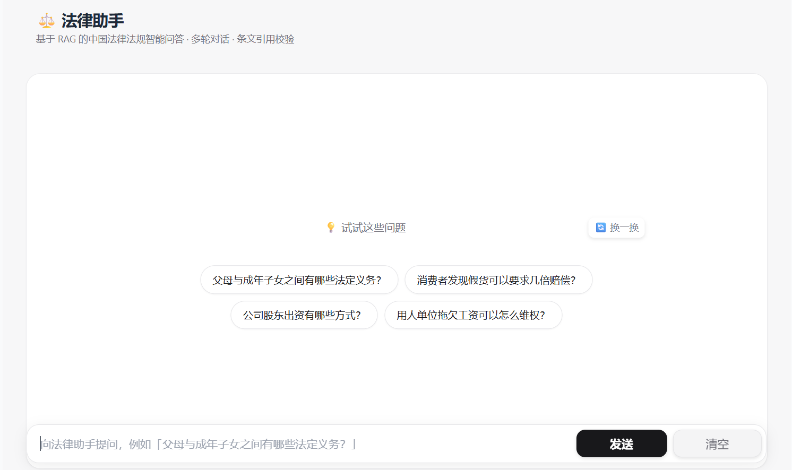

# 中国法律助手 RAG 系统

基于 RAG（检索增强生成）的中国法律法规智能问答系统。内置《中华人民共和国民法典》并精选接入刑法、公司法、劳动法、消费者权益保护法等 38 部常用法律法规（合计 5165 条），可继续扩充。



## 特性

- ✅ **多法律覆盖**：民法典 + 精选刑事/商事/劳动/行政/诉讼等 38 部法律（5165 条），可按目录继续扩充
- ✅ **混合检索**：向量召回 + BM25 关键词召回，加权 RRF 融合，兼顾语义与法律术语精确匹配
- ✅ **多跳检索 Agent（深度模式）**：LangGraph 状态机（Planner/Retrieve/Reflect/Answer），对"被辞退能不能告、怎么告"这类多诉求问题自动拆解、多轮检索、反思补全——跨法律条文召回率 0.597→0.825。简单题自动走单跳快路径，不画蛇添足
- ✅ **跨法律引用校验**：按「《法律名》第X条」核对引用，杜绝把甲法条号安到乙法上，醒目徽章标注
- ✅ **准确引用**：答案强制写明法律名与条号（《中华人民共和国公司法》第X条）
- ✅ **多轮对话**：支持追问，自动改写依赖上下文的问题（如"有无例外"→"诉讼时效的例外"）再检索
- ✅ **流式输出**：回答逐字呈现，无需等待整段生成
- ✅ **配额感知故障转移**：模型配额超限（429）时自动切换下一档，断路器记住已耗尽/限速的档直接跳过；显式超时防服务端挂起；末档可挂任意供应商真正兜底
- ✅ **Query embedding 缓存**：相同问题的 query 向量本地缓存，省 embedding 配额、降首字延迟
- ✅ **相关性闸门**：距离阈值拦截无关问题（如天气、菜谱），返回"未找到相关条文"
- ✅ **反馈难例闭环**：内置 👍/👎 反馈按钮，落盘到 `data/feedback.jsonl`，可作难例集回灌评估
- ✅ **双口径评估**：检索 Coverage（多跳召回率）+ 答案质量（LLM-as-judge 四维打分），单跳/Agent 可对比
- ✅ **可切换 Embedding**：支持 ModelScope API 和 SiliconFlow API 两种供应商
- ✅ **本地向量库**：ChromaDB 本地持久化，无需额外服务器
- ✅ **合规设计**：内置免责声明，明确不构成法律建议

## 快速开始

### 1. 安装依赖

建议使用虚拟环境，并用清华镜像源加速：

```bash
python -m venv .venv
# Windows: .venv\Scripts\activate    macOS/Linux: source .venv/bin/activate
pip install -r requirements.txt -i https://pypi.tuna.tsinghua.edu.cn/simple
```

### 2. 配置 API 密钥

复制 `.env.example` 为 `.env`，填入你的 API 密钥：

```bash
cp .env.example .env
```

编辑 `.env`：
```ini
# ModelScope（必填，用于 LLM）
MODELSCOPE_API_KEY=your_modelscope_token_here
LLM_MODEL=deepseek-ai/DeepSeek-V3.2

# 模型故障转移链（可选）：首选模型配额超限时按序自动切换。
# 每档可以是「纯模型名」（继承主供应商 key/base_url），也可以是「模型|key|base_url」
# 自带 API 的完整档位——把异构供应商放最后一档即可真正兜底，避免同一家全部 429 一起熄火。
# LLM_FALLBACK_MODELS=ZhipuAI/GLM-5,deepseek-chat|sk-xxxx|https://api.deepseek.com/v1

# Embedding 供应商选择（推荐 siliconflow，ModelScope 免费额度较严）
EMBEDDING_PROVIDER=siliconflow

# SiliconFlow（embedding 推荐，免费额度充足）
SILICONFLOW_API_KEY=your_siliconflow_token_here
```

**获取 API 密钥：**
- ModelScope: [modelscope.cn](https://modelscope.cn) → 访问令牌
- SiliconFlow: [cloud.siliconflow.cn](https://cloud.siliconflow.cn) → API 密钥

### 3. 初始化（首次运行）

```bash
python main.py setup
```

这会：
1. 解析法律文本：民法典（`data/raw/`）+ 精选目录（`src/law_catalog.py` 里在本地 `Laws/` 能找到的法律）
2. 生成统一的 JSON 数据（`data/processed/civil_code.json`，含全部已接入法律）
3. 调用 embedding API 构建向量库（存储在 `vector_store/`）
4. 末尾打印向量库体积，超过 `VECTOR_STORE_WARN_MB`（默认 150MB）时提示

> 想接入更多法律，需先把 [LawRefBook/Laws](https://github.com/LawRefBook/Laws) 克隆到项目根的 `Laws/` 目录（该目录不随本仓库提交）。仅接入民法典时无需 `Laws/`，`data/raw/` 已自带。

### 4. 启动 Web 服务

```bash
python main.py serve
```

默认访问地址：`http://localhost:7860`

## 目录结构

```
legal-assistant-rag/
├── data/
│   ├── raw/              # 民法典原始 markdown（从 LawRefBook 下载，按编拆分）
│   ├── processed/        # 解析后的统一 JSON（含全部已接入法律）
│   └── feedback.jsonl    # 用户 👍/👎 反馈日志（运行时生成，攒难例集用）
├── Laws/                 # LawRefBook/Laws 源仓库（本地克隆，不提交；接入多法律时需要）
├── src/
│   ├── config.py        # 配置管理（API key、异构故障转移链、检索参数、品牌文案）
│   ├── law_catalog.py   # 精选法律目录（定义接入哪些法律，加一行即可扩充）
│   ├── parser.py        # 通用 LawRefBook 解析器（任意法律、多段条文、第X条之一）
│   ├── embedding.py     # 可切换的 embedding 客户端（ModelScope/SiliconFlow）+ query 缓存
│   ├── embed_cache.py   # query embedding 磁盘 LRU 缓存
│   ├── bm25_retriever.py  # BM25 关键词检索（jieba 分词，分词语料磁盘缓存）
│   ├── reranker.py      # rerank 精排客户端（可选，默认关闭）
│   ├── vector_store.py  # 向量库 + 混合检索 + RRF 融合 + 距离闸门（跨法律唯一 ID）
│   ├── rag.py           # RAG 问答链（检索 + 改写 + 配额感知故障转移 + 跨法律引用校验）
│   ├── agent.py         # 多跳检索 Agent（LangGraph 状态机：Planner/Retrieve/Reflect/Answer）
│   ├── tools.py         # Agent 工具层（检索包装 + 合并去重 + 交叉引用 + 时效计算）
│   └── web.py           # Gradio Web 界面（流式 + 多轮 + 深度模式开关 + 轨迹展示 + 反馈）
├── eval/
│   ├── README.md        # 评估体系说明（检索 Coverage / 答案质量 两种口径）
│   ├── eval_set.json    # 检索评估集（100 题，覆盖 37 部法律）
│   ├── evaluate.py      # 检索评估脚本（Recall@K / Hit@K / MRR）
│   ├── answer_set.json  # 答案质量评估集（覆盖多部法律 + 负样本）
│   ├── eval_answer.py   # 答案质量评估脚本（LLM-as-judge，支持 --mode single/agent）
│   ├── multihop_set.json   # 多跳评估集（20 题，标注跨法律期望条文）
│   ├── eval_multihop.py    # 多跳检索评估（Coverage/LawCoverage，支持 single/fixed/agent）
│   └── *.json（结果）   # 各阶段评估结果（baseline/phase1/phase2/answer_*，见 eval/README.md）
├── vector_store/        # 预构建向量库 + BM25 缓存（随仓库提交，供创空间免冷启动）
│   └── _query_cache/    # query embedding 磁盘缓存（运行时生成，不入库）
├── main.py              # 本地入口（setup / serve）
├── app.py               # 创空间入口（0.0.0.0:7860 + 向量库缺失兜底构建）
├── requirements.txt
├── .env.example         # 配置模板
└── README.md
```

## 架构设计

```
用户提问
    ↓
0. 查询改写（多轮场景：用历史把追问补全成独立问题）
    ↓
1. 混合检索：向量召回 + BM25 召回 → 加权 RRF 融合（向量权重 5 : BM25 权重 1）
    ↓
2. 相关性闸门：最佳距离 > 阈值则判定无关，返回"未找到相关条文"
    ↓
3. 构造 Prompt（Top-K 条文 + 问题 + 强制引用指令）+ 历史对话
    ↓
4. LLM 流式生成（配额超限自动故障转移，末档可挂异构供应商兜底）
    ↓
5. 引用校验：按「《法律名》第X条」核对引用是否都在检索结果中（跨法律不串号）
    ↓
6. 返回（流式答案 + 引用条文 + 校验徽章 + 免责声明）
```

**数据流通用 Schema：**
```python
LawArticle {
  law_name: "中华人民共和国公司法"
  part: ""                  # 编（仅民法典等少数法律有）
  chapter: "第一章 总则"
  section: ""
  article_no: 133           # 条号
  sub_no: 1                 # "第X条之一"→1，普通条为 0；保证条号唯一不被覆盖
  article_text: "在道路上驾驶机动车..."
  effective_date: "2024-07-01"
}
```

### 多跳检索 Agent（深度模式）

上面的单跳链对"被违法辞退能不能告、怎么告"这类**多诉求问题**力不从心——单次检索召回的条文常不完整（赔偿标准、仲裁程序、时效分散在不同法律）。深度模式用 LangGraph 状态机解决：

```
                  ┌─────────────┐
   用户提问 ───►   │  Planner    │  判断简单/复杂；复杂则拆成 2~4 个子问题
                  └──────┬──────┘
                         ↓
              ┌──────────────────────┐
              │   Retrieve            │  ◄── 复用单跳的混合检索栈（一行不改）
              │   （逐子问题检索+合并去重）│
              └──────────┬───────────┘
                         ↓
                  ┌──────────────┐   不够（缺哪个诉求点）
                  │  Reflect     │ ──────────────► 回 Retrieve（受 max_hops 上限）
                  └──────┬───────┘
                         ↓ 够了
                  ┌──────────────┐
                  │  Answer      │  复用单跳的 prompt + 引用校验
                  └──────────────┘
```

**关键设计**：
- **模型分级**：Planner/Reflect 用便宜快模型，Answer 用强模型——压住多跳放大的 API 成本
- **可降级**：Planner 判简单题直接单跳作答，不为难简单题（守住回归底线）
- **防死循环**：`MAX_HOPS` 硬上限 + 每跳子问题去重
- **可观测**：每节点写 trace（查了什么、Reflect 怎么判断），Web 端展示检索轨迹
- **专用工具**（可选）：交叉引用（顺"依照第X条"拉关联条文）、时效计算（劳动/民事/刑事）

效果：跨法律条文召回率（Coverage）从单跳 0.597 提升到 0.825，且整部法律不再漏召（LawCoverage 0.95→0.98）。详见 [EVAL_REPORT.md](EVAL_REPORT.md)。

## 技术栈

- **数据源**：[LawRefBook/Laws](https://github.com/LawRefBook/Laws) 法律 markdown（通用解析器）
- **Embedding**：SiliconFlow API（推荐，bge-m3）/ ModelScope API（备选）+ query 磁盘缓存
- **关键词检索**：jieba 分词 + rank_bm25（BM25Okapi），分词语料磁盘缓存
- **向量库**：ChromaDB（本地文件型）
- **检索融合**：加权 Reciprocal Rank Fusion（RRF）
- **LLM**：ModelScope API（DeepSeek-V3.2 / Qwen3 / GLM-5 等中文模型，支持跨供应商异构故障转移）
- **Web 框架**：Gradio

## 评估

### 检索评估（Recall / Hit / MRR）

量化检索质量，每次调参后可对比效果：

```bash
python -m eval.evaluate            # 用默认 Top-K
python -m eval.evaluate --top-k 10
```

指标说明：
- **Recall@K**：期望条文被召回的比例
- **Hit@K**：至少命中一条期望条文的题目比例
- **MRR**：首个命中条文排名的倒数（衡量命中条文是否靠前）

当前混合检索在 100 题评估集（覆盖 37 部法律）上：Recall@8 ≈ 0.975，Hit@8 = 1.000，MRR ≈ 0.866。

### 答案质量评估（LLM-as-judge）

检索好不等于答得好。答案评估跑完整 RAG，再用裁判模型按四个维度打分（1~5）：
准确性 / 忠于检索 / 引用规范 / 表达清晰，并含一道无关问题负样本（考察是否正确拒答）。

```bash
python -m eval.eval_answer                 # 评估全部题目
python -m eval.eval_answer --limit 3       # 只评前 3 题（省配额）
python -m eval.eval_answer --save out.json # 同时落盘逐题明细
```

> 答案评估每题至少 2 次 LLM 调用（生成 + 裁判），注意配额。`--mode agent` 走多跳 Agent。

### 多跳检索评估（Coverage，深度模式）

衡量多跳 Agent 相对单跳的召回提升，题集是 20 道答案需 ≥2 次检索才完整的多跳题：

```bash
python -m eval.eval_multihop --mode single          # 单跳基线
python -m eval.eval_multihop --mode fixed           # 固定多跳（先拆完一次性查）
python -m eval.eval_multihop --mode agent           # LangGraph Agent（自适应补跳）
```

| 模式 | Coverage | LawCoverage | 平均轮数 |
|------|----------|-------------|----------|
| 单跳基线 | 0.597 | 0.950 | 1 |
| 固定多跳 | 0.666 | 0.983 | 2.0 |
| **Agent（深度模式）** | **0.825** | **0.983** | 1.90 |

> 单跳即便把 top_k 翻倍（8→16）也只到 0.73——证明缺口是结构性的（单 query 召不全跨法律条文簇），
> 需要多跳规划。完整评估报告见 [EVAL_REPORT.md](EVAL_REPORT.md)，两种口径说明见 [eval/README.md](eval/README.md)。

### 反馈难例闭环

每条 AI 回答下方都有 👍/👎 按钮，点击会把当前问题、改写后的查询、引用条文、引用校验状态等
追加到 `data/feedback.jsonl`（每行一条 JSON）。攒一段时间后，可把"👎"或"引用校验告警"的题目
挑出来回灌进 `eval/eval_set.json` / `answer_set.json`，定向修补检索/生成质量。

可在 `.env` 设 `FEEDBACK_LOG_ENABLED=false` 关闭。

## 扩展更多法律

解析器已通用化，新增一部 LawRefBook 法律**无需改代码**：

1. 把 [LawRefBook/Laws](https://github.com/LawRefBook/Laws) 克隆到项目根的 `Laws/` 目录
2. 在 [src/law_catalog.py](src/law_catalog.py) 的 `LAW_CATALOG` 加一行：`("分类/法律名(日期).md", "生效日期")`
3. 重新运行 `python main.py setup`

解析器会自动识别法律名（取文件首个 `# 标题`）、跳过 `<!-- INFO END -->` 元信息、正确处理多段条文与「第X条之一」。条文 ID 以 `(法律名, 条号, 之N)` 组合保证跨法律唯一，引用校验也按法律名区分，互不串号。

**注意接入范围**：精选目录刻意只含高频「法律」正文，未含司法解释 / 案例 / 地方法规——它们体量大、格式各异，会显著抬高 embedding 成本与向量库体积。接入越多，向量库越大（setup 末尾有体积护栏提示）。

## 部署到 ModelScope 创空间

本项目已为创空间部署做了适配：入口是 [app.py](app.py)（创空间默认运行它），绑定 `0.0.0.0:7860` 对外提供服务。**预构建向量库（`vector_store/`）和解析后的 JSON（`data/processed/`）已随仓库提交**，因此创空间冷启动无需重建索引，也不消耗 embedding 配额；万一向量库缺失，`app.py` 会现场兜底构建。

部署步骤：

1. 在 [ModelScope 创空间](https://modelscope.cn/studios) 创建新应用（SDK 选 Gradio）
2. 将本仓库推送 / 上传到创空间 Git（确保 `vector_store/` 一并提交）
3. 在创空间「环境变量」中配置密钥（**不要把 `.env` 提交到仓库**）：
   - `MODELSCOPE_API_KEY` —— LLM 生成
   - `SILICONFLOW_API_KEY` —— 每次提问的 query embedding
   - `EMBEDDING_PROVIDER=siliconflow`
   - 可选：`LLM_MODEL` / `LLM_FALLBACK_MODELS`
4. 创空间会自动运行 `app.py`，发布后即可获得永久公网 URL

> 说明：query embedding 在每次提问时仍需调用 embedding API，因此 `SILICONFLOW_API_KEY` 必须配置；只有「构建向量库」这一步被预提交的索引省掉了。

## 注意事项

- **法律时效性**：各部法律以接入时 LawRefBook 收录的版本为准（见 `effective_date`），不含后续修正与司法解释；以官方最新公布文本为准
- **免责声明**：所有答案仅供参考，不构成法律建议
- **API 限额**：免费 API 有调用次数限制，生产环境建议升级付费或本地部署模型
- **数据准确性**：虽已尽力确保，但法律条文解析可能存在误差，使用前请核对原文

## License

本项目代码采用 MIT 协议。

法律数据来源于 [LawRefBook/Laws](https://github.com/LawRefBook/Laws)，为公开法律文本。
