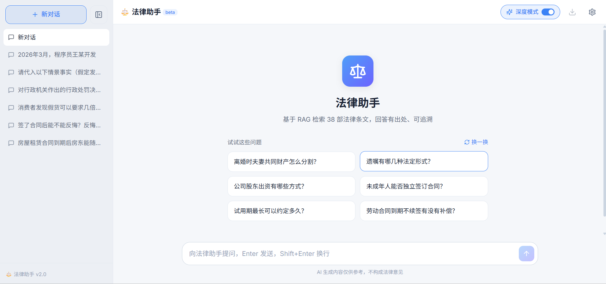

# 中国法律助手 RAG 系统

基于 RAG（检索增强生成）的中国法律法规智能问答系统。内置《中华人民共和国民法典》+ 精选 38 部常用法律（合计 5165 条），支持多跳检索、引用校验、多轮对话。



## 核心特性

- **多跳检索 Agent（深度模式）**：对"被辞退能不能告、怎么告"等多诉求问题自动拆解、多轮检索、反思补全——跨法律条文召回率从单跳 0.597 提升到 0.825。简单题自动走单跳快路径
- **引用校验**：答案强制写明《法律名》第X条，按法律名核对，防止张冠李戴，醒目徽章标注
- **混合检索**：向量召回 + BM25 关键词召回，RRF 融合，兼顾语义与法律术语精确匹配
- **配额感知故障转移**：模型配额超限(429)自动切换下一档，断路器跳过已耗尽档位，末档可挂异构供应商兜底
- **多轮对话**：支持追问，自动改写依赖上下文的问题（"有无例外"→"诉讼时效的例外"）再检索
- **流式输出 + 现代交互**：即时气泡、深度模式实时轨迹、条号锚点跳转、浅色清雅 UI
- **双口径评估**：检索 Coverage（多跳召回率）+ 答案质量（LLM-as-judge），单跳/Agent 可对比
- **反馈闭环**：👍/👎 落盘到 feedback.jsonl，可作难例集回灌

## 快速开始

### 1. 安装依赖

```bash
python -m venv .venv
# Windows: .venv\Scripts\activate    macOS/Linux: source .venv/bin/activate
pip install -r requirements.txt -i https://pypi.tuna.tsinghua.edu.cn/simple
```

### 2. 配置 API 密钥

```bash
cp .env.example .env
```

编辑 `.env`，填入：

```ini
# ModelScope（必填，LLM 生成）
MODELSCOPE_API_KEY=your_token
LLM_MODEL=deepseek-ai/DeepSeek-V4-Flash

# 故障转移链（可选，配额超限时按序切换）
LLM_FALLBACK_MODELS=Qwen/Qwen3-Next-80B-A3B-Instruct,deepseek-ai/DeepSeek-V3.2

# Embedding 供应商（推荐 siliconflow，免费额度充足）
EMBEDDING_PROVIDER=siliconflow
SILICONFLOW_API_KEY=your_token
```

**获取密钥**：[modelscope.cn](https://modelscope.cn)（访问令牌）、[cloud.siliconflow.cn](https://cloud.siliconflow.cn)（API 密钥）

### 3. 初始化向量库

```bash
python scripts/build_index.py
```

会解析法律文本（民法典 + 精选目录，来自本地 `Laws/`）、调用 embedding API 构建向量库（存储在 `vector_store/`）。

> 需先克隆 [LawRefBook/Laws](https://github.com/LawRefBook/Laws) 到项目根的 `Laws/` 目录。
> 仓库已预置构建产物（`vector_store/` + `data/processed/articles.json`），仅运行服务无需此步。

### 4. 启动服务

```bash
# 终端 1：后端
python api.py        # FastAPI :8000

# 终端 2：前端
cd web
npm install
npm run dev          # Vue :5173
```

打开 http://localhost:5173

## 项目结构

```
legal-assistant-rag/
├── data/
│   ├── processed/        # 解析后的统一 JSON（articles.json，含全部 38 部法律）
│   └── feedback.jsonl    # 用户反馈日志
├── Laws/                 # LawRefBook/Laws 克隆（本地，不入库，构建/扩展法律用）
├── src/
│   ├── config.py        # 配置（API key、故障转移链、检索参数）
│   ├── law_catalog.py   # 精选法律目录（38 部法律清单）
│   ├── parser.py        # 通用 LawRefBook 解析器
│   ├── embedding.py     # 可切换 embedding（ModelScope/SiliconFlow）+ query 缓存
│   ├── vector_store.py  # 向量库 + 混合检索 + RRF 融合
│   ├── rag.py           # RAG 链（检索 + 改写 + 配额感知故障转移 + 引用校验）
│   ├── agent.py         # 多跳检索 Agent（LangGraph：Planner/Retrieve/Reflect/Answer）
│   └── tools.py         # Agent 工具（检索包装 + 交叉引用 + 时效计算）
├── scripts/
│   └── build_index.py   # 向量库构建脚本
├── eval/
│   ├── README.md        # 评估体系说明
│   ├── EVAL_REPORT.md   # 评估报告（双口径对比）
│   ├── eval_set.json / answer_set.json / multihop_set.json  # 评估题集
│   ├── evaluate.py / eval_answer.py / eval_multihop.py      # 评估脚本
│   └── _discover_articles.py  # 多跳题辅助
├── web/                  # Vue 3 前端（TypeScript + Vite + Pinia）
├── vector_store/         # 预构建向量库（随仓库提交，免冷启动）
├── api.py                # FastAPI 后端
└── requirements.txt
```

## 技术栈

- **后端**：FastAPI + LangGraph（多跳 Agent 状态机）
- **前端**：Vue 3 + TypeScript + Vite + Tailwind CSS v4 + Pinia
- **向量库**：ChromaDB（本地持久化）
- **检索**：向量召回（BAAI/bge-base-zh-v1.5）+ BM25 + RRF 融合
- **LLM**：ModelScope / SiliconFlow API（可切换，支持异构故障转移）

## 评估体系

### 检索质量（Recall/Coverage）

```bash
python -m eval.evaluate                    # 基础单跳检索（100 题，37 部法律）
python -m eval.eval_multihop --mode single # 单跳基线（20 题多跳题集）
python -m eval.eval_multihop --mode agent  # Agent 深度模式
```

**多跳评估结果**（20 题，需 ≥2 次检索才完整）：

| 模式 | Coverage | LawCoverage | 平均轮数 |
|------|----------|-------------|----------|
| 单跳基线 | 0.597 | 0.950 | 1 |
| **Agent（深度模式）** | **0.825** | **0.983** | 1.90 |

> Coverage：期望条文被召回的比例；LawCoverage：期望涉及的法律被触及的比例。
> 详见 [eval/EVAL_REPORT.md](eval/EVAL_REPORT.md) 和 [eval/README.md](eval/README.md)。

### 答案质量（LLM-as-judge）

```bash
python -m eval.eval_answer --mode single   # 单跳模式
python -m eval.eval_answer --mode agent    # 深度模式
python -m eval.eval_answer --limit 3       # 只评前 3 题（省配额）
```

用裁判模型按四维度打分（1~5）：准确性 / 忠于检索 / 引用规范 / 表达清晰。

## 扩展更多法律

新增法律无需改代码：

1. 克隆 [LawRefBook/Laws](https://github.com/LawRefBook/Laws) 到项目根的 `Laws/` 目录
2. 在 [src/law_catalog.py](src/law_catalog.py) 的 `LAW_CATALOG` 加一行：
   ```python
   ("分类/法律名(日期).md", "生效日期")
   ```
3. 重新运行 `python scripts/build_index.py`

解析器自动识别法律名、处理多段条文与「第X条之一」，条文 ID 以 `(法律名, 条号, 之N)` 保证跨法律唯一。

> **注意**：接入越多，向量库越大（setup 末尾有体积护栏提示）。精选目录刻意只含高频「法律」正文，未含司法解释/案例/地方法规。

## 部署

### 单端口（生产，前后端合体）

构建前端后，FastAPI 直接托管静态产物 + 提供 API，单进程单端口：

```bash
cd web && npm run build && cd ..   # 产出 web/dist
python api.py                       # 默认 :8000，访问 http://localhost:8000
```

`api.py` 在 `/` 托管 `web/dist`、`/api/*` 提供接口，端口由环境变量 `PORT` 控制（默认 8000）。

### Docker / ModelScope 创空间

仓库含 [Dockerfile](Dockerfile)（多阶段：Node 构建前端 → Python 运行），监听 `7860`：

```bash
docker build -t legal-assistant .
docker run -p 7860:7860 --env-file .env legal-assistant
```

创空间部署（SDK 选 **Docker**）：
1. 推送仓库到创空间 Git（确保 `vector_store/` + `data/processed/` 一并提交，免冷启动重建）
2. 在创空间「环境变量」配置密钥（**勿提交 `.env`**）：`MODELSCOPE_API_KEY` / `SILICONFLOW_API_KEY` / `EMBEDDING_PROVIDER=siliconflow`
3. 创空间按 Dockerfile 构建，发布后获得公网 URL

> 仅运行无需重建索引；但 query embedding 每次提问仍调 API，`SILICONFLOW_API_KEY` 必须配置。

### 本地开发（前后端分离，热更新）

```bash
python api.py          # 后端 :8000
cd web && npm run dev  # 前端 :5173（Vite 代理 /api → :8000）
```

## 注意事项

- **法律时效性**：以接入时 LawRefBook 版本为准（见 `effective_date`），不含后续修正
- **免责声明**：所有答案仅供参考，不构成法律建议
- **API 限额**：免费 API 有调用次数限制，注意配额
- **数据准确性**：法律条文解析可能存在误差，使用前请核对原文

## License

代码采用 MIT 协议。法律数据来源于 [LawRefBook/Laws](https://github.com/LawRefBook/Laws)（公开法律文本）。
